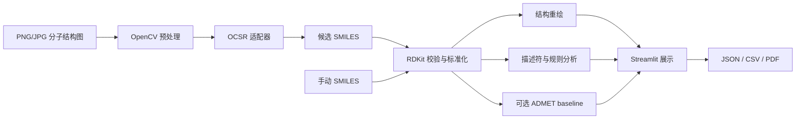

# 基于计算机视觉的分子结构图像识别与性质分析系统

本项目面向化学文献数字化、实验记录整理和分子结构数据归档场景，目标是把二维分子结构图片尽可能可靠地转成可校验、可编辑、可导出的结构化结果。系统基于 Python、OpenCV、可选 OCSR 模型和 RDKit，提供单图识别、批量处理、PDF/多分子文档区域检测、人工纠错、结构校验、分子重绘、基础性质分析和报告导出。

当前仓库是一个工程化应用原型，而不是已经完成大规模真实数据验证的商用 OCSR 产品。默认 demo 后端只用于流程演示；真实图片识别需要安装并配置 MolScribe、DECIMER 或其他 OCSR 后端。生产模式会禁止 demo 伪装成真实识别，并在真实后端不可用时给出明确错误。

## 项目定位

论文、专利、实验记录和药物资料中的分子结构常以图片存在，无法直接用于数据库检索、性质计算或机器学习建模。本项目重点解决的是 OCSR 工程闭环：

- 图片或文档页面进入系统后，先完成格式检查、预处理、区域检测和候选裁剪；
- 通过统一适配器调用 MolScribe、DECIMER、ensemble 或 demo 后端；
- 用 RDKit 对候选 SMILES 做解析、标准化、结构重绘和描述符计算；
- 在前端展示识别状态、统一识别决策、失败原因、模型来源、置信信息和人工修正入口；
- 将人工纠错样本、评测集和导出报告沉淀下来，支持后续真实测试集建设。

项目不把普通图像分类当作目标，也不承诺从零训练大型 OCSR 模型。更实际的目标是：让用户能稳定上传、识别、核验、纠错、导出，并逐步积累可复现的真实测试集。

## 当前能力

- 单图识别：上传分子结构图片，执行 OCSR、RDKit 校验、结构重绘、性质计算和人工纠错；
- 手动 SMILES：识别失败时仍可手动输入并生成同一套结构分析报告；
- 批量处理：对图片目录逐个处理，导出 CSV/JSON，并记录成功率、有效率和失败原因；
- PDF/多分子文档：渲染 PDF 或页面图片，检测分子候选区域，支持 bbox 编辑、区域类型标注和单区域重处理；
- 真实后端接入：支持 MolScribe、DECIMER 和多模型 ensemble；真实后端建议在独立子进程中执行，避免模型崩溃拖垮 UI；
- 生产模式：`APP_MODE=production` 下禁止 demo 识别，启动时可执行后端自检和 warm-up；
- 人工纠错回流：保存原图、预测、修正 SMILES、来源、隐私和 review 状态，可导出训练/评测 manifest；
- 评测框架：支持 canonical SMILES、InChIKey、Tanimoto、拒识样本、分类/回归指标和真实验收集脚本；
- 可选 ADMET baseline：用户提供带标签 CSV 后，可训练单终点 baseline，并记录验证指标和 applicability domain；
- 报告导出：输出 JSON、CSV、PDF、结构图和文档区域包。

## 当前边界

- demo 后端不识别任意图片，只按内置样例文件名返回固定结果；
- MolScribe、DECIMER 的真实效果取决于模型权重、依赖版本、GPU/CPU 环境和输入图片质量；
- PDF 区域检测当前以启发式 OpenCV 为 fallback，可接入训练式版面检测器，但复杂论文页面仍需要人工确认；
- 反应箭头、反应条件和疑似反应式会被分流，不会作为普通单分子直接送入 OCSR；本项目暂不解析完整化学反应；
- ADMET baseline 只适合作为教学和流程验证，不替代实验数据、专业 QSAR 模型或药物研发结论；
- 项目要走向“用户真能用且愿意用”，下一步最重要的是持续收集、标注和评测真实测试集。

## 技术路线图



## 环境要求

- Python 3.10（推荐；真实 OCSR 依赖的 TensorFlow/DECIMER/Keras 组合以 3.10 环境验证）；
- CPU 即可运行 demo、OpenCV 和 RDKit 主流程；
- GPU 仅作为真实 OCSR 后端的可选加速设备。

### Conda 安装（推荐）

完整环境可直接创建：

```bash
conda env create -f environment.yml
conda activate molecule-vision
```

也可以手动安装：

```bash
conda create -n molecule-vision python=3.10
conda activate molecule-vision
conda install -c conda-forge rdkit
pip install -r requirements.txt
```

> RDKit 优先推荐通过 conda-forge 安装。如果已由 conda 安装，`pip install -r requirements.txt` 会检测已有版本；遇到平台相关问题时可从 requirements 中临时注释 `rdkit` 一行。

### pip 安装

在支持 RDKit wheel 的 Python 3.10 平台上：

```bash
python -m venv .venv
# Windows: .venv\Scripts\activate
# macOS/Linux: source .venv/bin/activate
python -m pip install --upgrade pip
pip install -r requirements.txt
```

## 快速启动

先生成清晰的演示结构图：

```bash
python scripts/make_demo_samples.py
```

启动 Web：

```bash
python -m streamlit run app.py
```

浏览器中可上传 `data/samples/aspirin.png`，查看原图、所有预处理阶段、识别 SMILES、RDKit 重绘和性质结果。

### PyCharm 运行注意事项

项目解释器应明确指向：

```text
C:\Users\17679\.conda\envs\molecule-vision-310\python.exe
```

推荐在 Run Configuration 中以模块方式启动，Module name 填 `streamlit`，Parameters 填 `run app.py`。在终端中也优先使用 `python -m streamlit run app.py`，避免调用到其他环境中的 `streamlit.exe`。

可用以下命令核对当前解释器和核心依赖：

```powershell
python -c "import sys; print(sys.executable)"
python -c "import cv2, rdkit, streamlit; print(cv2.__version__, rdkit.__version__, streamlit.__version__)"
```

若终端启动时把整段 PATH 当作 PowerShell 命令执行，应关闭从异常终端继承环境的 PyCharm 实例，并从 Windows 开始菜单重新启动 PyCharm；也可将 PyCharm Terminal 的 Shell path 临时设为 `powershell.exe -NoProfile`。

## 命令行使用

分析手动 SMILES：

```bash
python scripts/analyze_smiles.py --smiles "CCO"
```

批量处理：

```bash
python scripts/run_batch.py --input data/batch_input --output data/outputs
```

也可直接批量处理生成的样例：

```bash
python scripts/run_batch.py --input data/samples --output data/outputs --backend demo
```

## OCSR 后端说明

后端可在 Streamlit 侧边栏选择，也可设置环境变量：

```bash
# Windows PowerShell
$env:OCSR_BACKEND="demo"

# macOS/Linux
export OCSR_BACKEND=demo
```

运行模式由 `APP_MODE` 控制：

```bash
APP_MODE=demo         # 允许演示后端，用于教学或本地功能演示
APP_MODE=production   # 禁止 demo 图片识别；真实后端不可用时阻止识别
```

生产模式启动前建议先执行一次真实后端自检。该命令会检查后端可用性、RDKit、模型加载和一次 warm-up 推理，失败时返回非 0：

```bash
python scripts/check_ocsr_backend.py --backend molscribe --production --warmup
```

`start_gpu_app.sh` 默认使用 `APP_MODE=production`、`OCSR_BACKEND=molscribe` 并自动运行上述生产自检；需要演示模式时请直接使用普通 Streamlit 启动命令，或显式设置 `APP_MODE=demo`。

### demo

默认模式不加载机器学习模型，而是根据文件名匹配四个内置样例：

| 文件名关键词 | SMILES |
|---|---|
| `aspirin` | `CC(=O)OC1=CC=CC=C1C(=O)O` |
| `caffeine` | `Cn1cnc2c1c(=O)n(C)c(=O)n2C` |
| `benzene` | `c1ccccc1` |
| `ethanol` | `CCO` |

界面会明确提示当前主动选择的是 demo 后端。RDKit 和 OpenCV 不是 OCSR 模型；只有额外安装并配置 MolScribe/DECIMER 后，才能切换到真实图像识别后端。

### MolScribe

MolScribe 是可选依赖，不会在项目启动时被强制导入。按照其对应版本文档安装后，设置模型文件与设备：

```bash
$env:MOLSCRIBE_MODEL_PATH="C:\path\to\checkpoint.pth"
$env:OCSR_DEVICE="auto"  # PyTorch CUDA 可用时使用 GPU；也可显式设为 cuda
python -m streamlit run app.py
```

不同 MolScribe 发行版本的模型构造与推理 API 可能变化；适配点集中在 `src/ocsr/molscribe_adapter.py`，不影响其他模块。

### DECIMER

DECIMER 同样是可选依赖。当前适配器支持暴露 `predict_SMILES` 的发行形式。若已安装版本的模块路径不同，只需调整 `src/ocsr/decimer_adapter.py` 中标注的适配位置。未安装或初始化失败时系统返回可读错误，不会崩溃。

适配器会优先请求后端返回置信度，并兼容不支持置信度参数的旧版本。Web 侧边栏会显示所选后端是否已成功加载。

## 可选 ADMET baseline

项目不会附带或伪造 ADMET 数据。准备一个至少包含 `smiles` 和目标标签列的可信 CSV 后，可训练单个分类或回归终点：

```bash
python scripts/train_admet.py \
  --input data/admet.csv \
  --smiles-column smiles \
  --target-column ames \
  --task classification \
  --split-strategy scaffold \
  --min-samples 20 \
  --output models/admet_baseline.joblib
```

训练脚本会执行 holdout 验证，默认优先使用 scaffold split；如果 scaffold 分组无法覆盖分类类别，会回退到分层随机拆分。分类任务会输出 ROC-AUC、PR-AUC、F1、MCC 和类别计数，回归任务会输出 MAE、RMSE、R²。模型 artifact 会记录验证指标、质量门槛和基于最近训练集 Tanimoto 相似度的 applicability domain；未通过质量门槛或超出适用域时，预测状态不会标记为 `success`。

训练完成后启用模型：

```bash
# Windows PowerShell
$env:ENABLE_ADMET_MODEL="true"
$env:ADMET_MODEL_PATH="models/admet_baseline.joblib"
python -m streamlit run app.py
```

模型文件使用 joblib 序列化，只应加载自己训练或可信来源的本地文件。未启用、文件缺失、预测失败、验证指标不达标或超出适用域时，系统会继续完成 RDKit 描述符与 Lipinski 规则分析。ADMET 输出仅是教学 baseline，不替代实验或专业结论。

## 测试

```bash
pytest -q
```

测试覆盖合法/非法 SMILES、canonical SMILES、描述符字段、规则超限、图像预处理、OCSR 兼容层、单图/手动 SMILES 端到端流程、批处理导出、PDF 报告以及可选 ADMET baseline。

## OCSR 真实测试集

项目提供了测试集构建和人工标注导入工具：

```bash
python scripts/build_ocsr_acceptance_set.py
python scripts/ingest_ocsr_labeled_images.py --labels data/raw_ocsr_real/labels.csv --image-root data/raw_ocsr_real
```

完整流程见 `docs/ocsr_dataset_curation.md`。真实验收集应记录来源、授权、scaffold/source split、图像质量、结构复杂度和拒识样本；不要把无授权论文截图或专有数据提交到公开仓库。

仓库内的 `data/ocsr_real_acceptance/` 是 starter smoke benchmark，不是正式真实世界准确率验收集。图片文件由 `.gitignore` 排除，但可以从固定上游版本确定性重建：

```bash
python scripts/download_real_acceptance_set.py
python scripts/validate_real_acceptance_set.py
python scripts/run_release_acceptance.py \
  --release-version starter-v0.1 \
  --manifest data/ocsr_real_acceptance/manifest.csv \
  --dataset-root data/ocsr_real_acceptance \
  --backends molscribe,ensemble
```

`source_manifest.csv` 记录固定 URL、上游版本、来源 SHA-256、最终图片 SHA-256、许可说明和派生操作。该 starter 只有少量独立来源，扰动图不能作为独立样本统计，不能用于宣称真实世界准确率，也不能在阈值调优后再作为独立测试集；默认 release gate 失败是允许且应保留的事实。

单图上传后会先进入持久运行目录，识别、纠错和反馈都复用该路径，不再依赖识别完成后即删除的临时文件：

```text
data/runs/<analysis_id>/
├── input/
│   └── original.<ext>
├── preprocessing/
├── structures/
├── report.json
└── runtime.json
```

`report["input"]["path"]` 会指向 `input/original.<ext>` 的持久路径。默认清理策略由 `RUN_RETENTION_DAYS=30` 和 `RUN_MAX_STORAGE_GB=10` 控制；进入反馈库、已审核或用户标记保留的 run 会在 `runtime.json` 中标记为 protected，不会被自动清理。

历史页的数据库记录是索引，会保留普通历史记录；未保护的运行目录允许在到期或超过存储预算时被自动清理。历史列表会按运行时状态显示 `artifact_status=available|expired|missing`：`available` 表示报告文件仍可打开和重新导出，`expired` 表示报告属于可过期的运行目录且文件已被清理，`missing` 表示报告路径为空或文件缺失。报告文件不可用时，“打开旧报告”和“重新导出”会禁用；如果原始输入仍存在，仍可点击“重新识别”。收藏会添加 `favorite` 保护原因；取消收藏只移除 `favorite`，不会移除反馈、审核等其它保护原因。

人工纠错也可以回流为数据集：单图识别页点击“仅保存纠错”会写入 `data/feedback/images`、`data/feedback/annotations` 和 `data/feedback/manifest.csv`；点击“确认进入训练集”会标记为已核验并可导出：

```bash
python scripts/export_feedback_manifest.py --feedback-root data/feedback --output data/feedback/verified_manifest.csv
```

## 项目目录

```text
molecule-vision-ocsr/
├── README.md
├── requirements.txt
├── environment.yml
├── config.py
├── app.py
├── data/
│   ├── samples/
│   ├── batch_input/
│   ├── runs/             # 单图上传后的持久运行目录
│   ├── feedback/         # 人工纠错与训练/评测回流数据
│   └── outputs/
├── models/                # 可选本地模型；模型文件不提交到 Git
├── src/
│   ├── preprocess/        # 图片读取、OpenCV 处理、过程可视化
│   ├── ocsr/              # 统一接口与 demo/MolScribe/DECIMER 适配器
│   ├── chem/              # RDKit 校验、描述符、规则、绘图
│   ├── analysis/          # 单分子报告与批处理编排
│   ├── export/            # JSON、CSV、可选 PDF
│   ├── ml/                # 可选 Morgan + Random Forest ADMET baseline
│   └── utils/             # 文件与日志工具
├── scripts/               # 批处理、SMILES 分析、样例生成、ADMET 训练
├── tests/                 # pytest 测试
└── docs/                  # 说明书、API 与报告模板
```

所有运行路径由 `config.py` 统一管理。单图上传原图与报告写入 `data/runs`，人工反馈写入 `data/feedback`，批量、文档和导出文件默认写入 `data/outputs`。

## 答辩演示建议

1. 说明医药研发和专利中结构图片难以直接检索的企业需求；
2. 展示“图片 → OpenCV → OCSR → SMILES → RDKit → 报告”的路线；
3. 上传 `aspirin.png`，逐步展示 CV 中间结果；
4. 展示 canonical SMILES、结构重绘、描述符和 Lipinski 判断；
5. 输入 `CCO` 展示手动分析的稳定备用流程；
6. 批量处理 `data/samples` 并下载 CSV；
7. 说明 demo 与真实 OCSR 的边界和后续升级方向。

## 局限性与免责声明

- 当前系统主要支持清晰的二维分子结构图片；
- 复杂图片、手绘结构、低分辨率图片可能识别失败；
- demo 模式不是真实分子识别，只用于系统演示；
- 真实 OCSR 需要安装 MolScribe 或 DECIMER；
- MolScribe/DECIMER 的安装方式、模型权重和推理 API 可能随版本变化；
- Lipinski 结果只反映简单规则，不代表吸收、毒性、疗效或可开发性；
- 性质分析为教学演示，不能替代真实药物实验或专业判断。

## 生产 MolScribe 后端配置

本项目默认仍使用 `demo` 后端，demo 只用于教学演示：它会按内置样例文件名返回固定 SMILES，不是真实图片识别。真实 OCSR 需要单独安装 MolScribe、下载模型权重，并把 `OCSR_BACKEND` 切换为 `molscribe`。如果 MolScribe 未安装、模型文件缺失或加载失败，Streamlit、手动 SMILES、RDKit 性质分析、demo 后端和 DECIMER 后端仍会继续工作，并显示可读错误。

本适配器按 MolScribe 官方仓库公开接口进行兼容：构造模型时优先使用 `MolScribe(model_path, device=...)`，推理时优先使用 `predict_image_file(path, return_confidence=True)`；不同发行版本若返回 `dict`、字符串、元组或列表，适配器会归一化为统一结果字段。已对公开仓库接口形状做验证，未声称支持未测试的私有改版 API。

### 安装步骤

```bash
conda create -n molecule-vision-310 python=3.10
conda activate molecule-vision-310
conda install -c conda-forge rdkit
python -m pip install --upgrade pip
pip install -r requirements.txt
```

按 MolScribe 官方说明安装可选依赖。安装方式可能随 MolScribe 版本变化，请以其官方仓库为准：[thomas0809/MolScribe](https://github.com/thomas0809/MolScribe)。

```bash
pip install MolScribe
```

模型权重请从可信来源下载到本机。推荐使用下载脚本，它会执行 SHA-256 计算、可选期望 SHA 校验、原子替换、DECIMER ZIP 路径穿越检查和大小限制，并在 `models/manifest.json` 中记录来源、版本、许可证提示和摘要：

```bash
python scripts/download_ocsr_models.py \
  --molscribe-revision main \
  --molscribe-sha256 <trusted_sha256_if_available> \
  --skip-decimer
```

如果没有官方或你自己维护的可信 SHA-256，可省略 `--molscribe-sha256`，脚本仍会记录本地实际摘要，但这只能用于后续复现，不能证明下载源未被替换。

不要把模型权重、大型数据集、虚拟环境或缓存文件提交到 Git。本仓库 `.gitignore` 已忽略 `models/*`、`*.pt`、`*.pth` 和 `*.onnx`。

### 环境变量

Windows PowerShell：

```powershell
$env:OCSR_BACKEND="molscribe"
$env:MOLSCRIBE_MODEL_PATH="C:\path\to\molscribe_model.pth"
$env:OCSR_DEVICE="cpu"
$env:MOLSCRIBE_IMAGE_STRATEGY="original"
python -m streamlit run app.py
```

Linux/macOS：

```bash
export OCSR_BACKEND=molscribe
export MOLSCRIBE_MODEL_PATH=/path/to/molscribe_model.pth
export OCSR_DEVICE=cpu
export MOLSCRIBE_IMAGE_STRATEGY=original
python -m streamlit run app.py
```

CUDA 示例：

```powershell
$env:OCSR_BACKEND="molscribe"
$env:MOLSCRIBE_MODEL_PATH="C:\path\to\molscribe_model.pth"
$env:OCSR_DEVICE="cuda"
python -m streamlit run app.py
```

常用配置：

| 变量 | 默认值 | 说明 |
|---|---|---|
| `MOLSCRIBE_MODEL_PATH` | `models/molscribe_model.pth` | MolScribe 权重文件路径，支持相对路径和绝对路径 |
| `MOLSCRIBE_MODEL_NAME` | 权重文件名 | 侧边栏和结果中显示的模型名 |
| `MOLSCRIBE_MODEL_VERSION` | 空 | 可选模型版本或标识 |
| `OCSR_DEVICE` | `auto` | `auto`、`cpu`、`cuda` 或 `cuda:0`；`auto` 优先 GPU、不可用时回退 CPU；显式 `cuda*` 不可用会失败 |
| `OCSR_TIMEOUT_SECONDS` | `120` | 单次推理超时时间 |
| `OCSR_STRICT_MODE` | `false` | 兼容旧配置；仅用于控制 `auto` 在 CUDA 不可用时是否允许回退 CPU |
| `OCSR_GPU_REQUIRED` | `false` | 为 `true` 时，`auto` 设备在 GPU 不可用时也会报错；显式 `cpu` 仍强制 CPU |
| `OCSR_USE_PREPROCESSED_IMAGE` | `false` | 兼容旧流程；默认 MolScribe 使用原图 |
| `MOLSCRIBE_IMAGE_STRATEGY` | `original` | `original`、`grayscale`、`normalized`、`binary` |
| `MOLSCRIBE_ISOLATED_SUBPROCESS` | `true` | 在独立子进程中执行真实模型推理，超时或取消时可终止进程树 |
| `RUNS_DIR` | `data/runs` | 单图上传后的持久运行目录 |
| `RUN_RETENTION_DAYS` | `30` | 未保护 run 的保留天数 |
| `RUN_MAX_STORAGE_GB` | `10` | 未保护 run 的最大总存储预算 |
| `DECISION_ACCEPT_THRESHOLD` | `0.85` | 已校准置信度达到该值时，单模型结果才可自动接受 |
| `DECISION_REVIEW_THRESHOLD` | `0.65` | 已校准置信度低于该值时进入人工确认 |
| `DECISION_MIN_IMAGE_QUALITY` | `0.55` | 图像质量分低于该值时进入人工确认或拒绝 |
| `DECISION_REQUIRE_CALIBRATED_CONFIDENCE` | demo: `false`; production: `true` | 为 `true` 时，未校准置信度的单模型结果不能自动接受 |

默认 `original` 更贴近 MolScribe 官方模型输入预期；不要默认假设二值化图片一定更好。只有在实验需要时再切换 `grayscale`、`normalized` 或 `binary`。

### 诊断命令

```bash
python scripts/check_ocsr_backend.py --backend demo
python scripts/check_ocsr_backend.py --backend molscribe
```

诊断输出包含 Python 版本、后端名称、包是否安装、包版本、模型路径、模型文件是否存在、设备、CUDA 是否可用、模型是否成功加载和可读错误。MolScribe 未安装时不会打印 Python 堆栈并崩溃。

### 常见错误

- `未安装 MolScribe`：先确认当前 Python 环境是否正确，再按官方说明安装 MolScribe。
- `模型文件不存在`：检查 `MOLSCRIBE_MODEL_PATH`，Windows 路径建议使用 PowerShell 字符串。
- `请求 CUDA 设备，但 torch.cuda.is_available() 为 False`：检查 NVIDIA 驱动、CUDA 版 PyTorch 和 `OCSR_DEVICE`；也可先用 `OCSR_DEVICE=cpu` 验证流程。
- `模型加载失败`：通常是权重文件与 MolScribe 代码版本不匹配，或模型文件损坏。请重新下载与当前 MolScribe 版本匹配的权重。
- `MolScribe 未返回 SMILES`：图片可能不符合模型输入分布，或该版本返回格式发生变化。可运行诊断脚本并保留错误信息用于适配。

## 生产 DECIMER 后端配置

DECIMER 也是可选真实 OCSR 后端。未安装 DECIMER 或 TensorFlow 环境不可用时，demo、MolScribe、手动 SMILES、RDKit、批处理和评测框架仍应继续运行。系统不会在 DECIMER 不可用时自动伪装成 demo 识别成功。

本适配器按 DECIMER Image Transformer 官方公开用法适配：[Kohulan/DECIMER-Image_Transformer](https://github.com/Kohulan/DECIMER-Image_Transformer)。官方安装方式为：

```bash
pip install decimer
```

本仓库提供了可选依赖清单，用于复现当前已验证环境：

```bash
python -m pip install -r requirements-decimer.txt
```

已在 Windows / Python 3.10 环境验证的版本：

```text
decimer==2.8.0
tensorflow==2.20.0
wrapt==2.2.2
tqdm==4.68.4
```

本机诊断还补齐了 TensorFlow/DECIMER 导入链需要的 `flatbuffers`、`libclang`、`termcolor`、`selfies`、`namex`、`tifffile`、`tensorboard-data-server` 和 `sympy`。这些依赖写在 `requirements-decimer.txt` 中，避免只在开发机上“临时可用”。DECIMER 首次初始化可能会把模型缓存下载到用户目录，例如 Windows 下的 `C:\Users\<用户名>\.data\DECIMER-V2`；该缓存不属于仓库内容，也不要提交到 Git。

公开推理接口为：

```python
from DECIMER import predict_SMILES
predict_SMILES(image_input, confidence=False, hand_drawn=False)
```

其中 `image_input` 可以是图片路径或 numpy 图像数组。不同版本可能返回字符串、元组、列表或字典；适配器会统一归一化为 `OCSRResult`。如果 DECIMER 只返回 token 级置信度或不返回可信整体置信度，系统会把 `confidence` 置为 `null`，不会伪造数值。

### CPU 启动

Windows PowerShell：

```powershell
$env:OCSR_BACKEND="decimer"
$env:DECIMER_DEVICE="cpu"
$env:DECIMER_IMAGE_STRATEGY="original"
python -m streamlit run app.py
```

Linux/macOS：

```bash
export OCSR_BACKEND=decimer
export DECIMER_DEVICE=cpu
export DECIMER_IMAGE_STRATEGY=original
python -m streamlit run app.py
```

### GPU/auto 启动

```powershell
$env:OCSR_BACKEND="decimer"
$env:DECIMER_DEVICE="auto"   # auto 会在 TensorFlow 检测到 GPU 时使用 GPU，否则回退 CPU
python -m streamlit run app.py
```

显式 GPU 模式：

```powershell
$env:OCSR_BACKEND="decimer"
$env:DECIMER_DEVICE="gpu"
python -m streamlit run app.py
```

`DECIMER_DEVICE=gpu` 表示必须使用 GPU；如果 TensorFlow 未检测到 GPU，DECIMER 会返回清晰错误，不会静默回退 CPU。`DECIMER_DEVICE=auto` 会优先 GPU，不可用时回退 CPU；只有在 `DECIMER_STRICT_MODE=true` 或 `OCSR_GPU_REQUIRED=true` 时才禁止 `auto` 回退。

### DECIMER 配置项

| 变量 | 默认值 | 说明 |
|---|---|---|
| `DECIMER_DEVICE` | `auto` | `auto` 优先 GPU、不可用时回退 CPU；`cpu` 强制 CPU；`gpu` 不可用会失败 |
| `DECIMER_TIMEOUT_SECONDS` | `120` | 单次初始化/推理超时时间 |
| `DECIMER_IMAGE_STRATEGY` | `original` | `original`、`grayscale`、`normalized`、`binary` |
| `DECIMER_MODEL_NAME` | `DECIMER Image Transformer` | 报告和界面显示用模型名 |
| `DECIMER_MODEL_VERSION` | 空 | 可选模型/包版本备注 |
| `DECIMER_STRICT_MODE` | `false` | 兼容旧配置；仅用于控制 `auto` 在 GPU 不可用时是否允许回退 CPU |
| `DECIMER_ISOLATED_SUBPROCESS` | `true` | 在独立子进程中执行真实模型推理，超时或取消时可终止进程树 |

当前官方 `decimer` 包通常自行管理模型资源；本项目不新增伪造的 DECIMER checkpoint 路径配置。如你使用的发行版本需要外部模型目录，应先按该版本官方说明安装配置，再用诊断脚本确认。

### DECIMER 诊断

```bash
python scripts/check_ocsr_backend.py --backend decimer
```

诊断输出包括 Python 版本、DECIMER 是否安装、包版本、TensorFlow 版本、GPU 状态、检测到的 GPU、设备选择、输入策略、初始化是否成功、最近推理耗时和可读错误信息。未安装或版本不兼容时不会直接打印未处理堆栈。

### DECIMER 常见错误

- `未安装 DECIMER`：确认当前 Python 环境后执行 `python -m pip install -r requirements-decimer.txt`。
- `No module named 'wrapt'`：TensorFlow 导入依赖缺失，安装 `requirements-decimer.txt` 或执行 `python -m pip install wrapt`。
- `No module named 'tqdm'`：DECIMER 依赖链缺失，安装 `requirements-decimer.txt` 或执行 `python -m pip install tqdm`。
- `TensorFlow 未检测到可用 GPU`：检查 NVIDIA 驱动、CUDA/cuDNN 与 TensorFlow 版本；也可先用 `DECIMER_DEVICE=cpu` 验证流程。
- `DECIMER 初始化失败`：可能是 TensorFlow、模型资源下载/缓存或版本兼容问题。请先运行诊断命令并记录包版本。
- `DECIMER 未返回 SMILES`：图片可能不符合模型输入分布，或该版本返回格式发生变化。

本机已验证 DECIMER 2.8.0 可以完成后端初始化诊断，并自动回退到 CPU。当前 Windows 环境未检测到 TensorFlow GPU，真实 GPU 推理仍需要你按目标平台配置匹配的 NVIDIA 驱动、CUDA/cuDNN 与 TensorFlow 运行时。默认单元测试仍使用 mock/fake 后端，不要求下载 DECIMER 模型。

## MolScribe + DECIMER ensemble 融合模式

`ensemble` 是统一的多后端 OCSR 模式，会保留 MolScribe 与 DECIMER 的全部原始候选，再用 RDKit 做标准化、有效性校验和候选差异解释。它可以用于 Streamlit、批处理 CLI 和 benchmark：

```powershell
$env:OCSR_BACKEND="ensemble"
$env:OCSR_ENSEMBLE_BACKENDS="molscribe,decimer"
$env:OCSR_ENSEMBLE_PARALLEL="false"
$env:OCSR_DEVICE="cuda"
$env:DECIMER_DEVICE="auto"
python -m streamlit run app.py
```

```bash
python scripts/run_batch.py --input data/batch_input --output data/outputs/batch --backend ensemble
python scripts/evaluate_ocsr.py --manifest benchmark/example_manifest.csv --backend ensemble --output data/outputs/benchmark
python scripts/check_ocsr_backend.py --backend ensemble
```

默认 `OCSR_ENSEMBLE_PARALLEL=false`，采用串行安全模式，避免在同一张 GPU 上同时加载多个大型模型导致显存压力。确认显存、CUDA/PyTorch/TensorFlow 配置稳定后，可以显式启用并行：

```powershell
$env:OCSR_ENSEMBLE_PARALLEL="true"
$env:OCSR_ENSEMBLE_TOTAL_TIMEOUT_SECONDS="240"
```

### 融合规则

- 后端执行成功优先于失败；
- RDKit 可解析候选优先于不可解析候选；
- canonical SMILES 或 InChIKey 相同的候选视为模型一致；
- 两个有效候选不一致时标记 `review_needed`，页面和报告会显示分歧警告，不会自动作为最终识别结果接受；
- 只有一个有效候选时标记 `accepted_with_warning`，保留候选但建议人工确认；
- `OCSR_ENSEMBLE_BACKEND_PRIORITY` 只作为展示和追溯的推荐排序依据，不用于把分歧结果强行升级为自动接受；
- 不直接比较 MolScribe 与 DECIMER 未校准的原始 confidence；
- 人工修正会覆盖 ensemble 推荐，并保留所有原始候选用于追溯。

可选配置：

| 变量 | 默认值 | 说明 |
|---|---|---|
| `OCSR_ENSEMBLE_BACKENDS` | `molscribe,decimer` | 启用的子后端 |
| `OCSR_ENSEMBLE_BACKEND_PRIORITY` | `molscribe,decimer` | 分歧时的暂选优先级 |
| `OCSR_ENSEMBLE_RELIABILITY_WEIGHTS` | `molscribe=1.0,decimer=1.0` | 实验性可靠性权重；当前不作为最终自动接受依据 |
| `OCSR_ENSEMBLE_PARALLEL` | `false` | 是否并行执行子后端 |
| `OCSR_ENSEMBLE_CONTINUE_ON_ERROR` | `true` | 单个后端失败时是否继续 |
| `OCSR_ENSEMBLE_TOTAL_TIMEOUT_SECONDS` | `240` | ensemble 总任务超时 |

### 分歧解释

当 MolScribe 与 DECIMER 给出不同有效分子时，系统会计算：

- canonical SMILES 是否相同；
- InChIKey 是否相同；
- Morgan fingerprint Tanimoto 相似度；
- 分子式是否相同；
- 原子数量差异；
- 总形式电荷差异。

这些指标只解释候选之间的结构差异，不能自动证明哪一个候选更符合原始图片。没有真实 benchmark 证明前，本项目不声称 ensemble 一定比单模型更准确。

### 本机 GPU 说明

本项目现在默认让 MolScribe 使用 `OCSR_DEVICE=auto`，当 PyTorch 能检测到 CUDA 时会使用本机 GPU；你也可以显式设置 `$env:OCSR_DEVICE="cuda"`。DECIMER 使用 TensorFlow，需 TensorFlow 能检测到 GPU 才会使用目标 GPU；如果诊断显示 TensorFlow 未检测到 GPU，DECIMER 会在 `auto` 模式下安全回退 CPU。后续若要强制 DECIMER 使用 GPU，建议先解决 TensorFlow GPU 运行时，再用：

```bash
python scripts/check_ocsr_backend.py --backend decimer
```

确认 `gpu_available: true` 后再跑真实 benchmark。

## 化学标准化与审计链

系统在 RDKit 可解析之后会生成独立的化学身份与标准化审计块，且不会覆盖模型原始输出或人工修正输入。JSON 报告中会同时保留：

- `ocsr.predicted_smiles`：模型原始 SMILES；
- `ocsr.predicted_canonical_smiles` 和 `ocsr.predicted_standardized_smiles`：模型输出的解析与标准化结果；
- `correction.corrected_smiles`：用户输入的人工修正；
- `final.raw_smiles`：最终来源的原始输入；
- `final.smiles` / `final.standardized_smiles`：用于性质计算和结构重绘的最终分析 SMILES；
- `chemical_identity`：canonical SMILES、standardized SMILES、InChI、InChIKey、分子式、形式电荷、片段数和手性中心数；
- `standardization.steps`：每一步的输入、输出、是否改变、warning、时间、RDKit 版本和 profile；
- `structure_warnings`：结构质量提示。

### 标准化 profile

通过环境变量选择：

```powershell
$env:CHEM_STANDARDIZATION_PROFILE="conservative"
python -m streamlit run app.py
```

可选值：

| profile | 行为 |
|---|---|
| `none` | 只解析、canonicalize 和生成身份标识，不执行 RDKit 标准化转换 |
| `conservative` | 默认值；执行 RDKit `Cleanup` / `Normalize`，不删除片段、不强制中和、不做互变异构归一 |
| `parent` | 执行金属断开、FragmentParent、LargestFragmentChooser 和 Uncharger，可能去除盐/溶剂/配位成分 |
| `tautomer_canonical` | 在 `parent` 基础上执行 Reionize 与 RDKit tautomer canonicalization |

默认采用 `conservative`，避免自动删除用户可能关心的盐、溶剂、多片段或配位结构。`parent` 和 `tautomer_canonical` 都可能改变化学含义，应只在明确需要 parent identity 或去重时启用。

### 结构质量提示

系统会提示：

- 多片段；
- 非零电荷；
- 未指定手性；
- 未指定 E/Z 双键；
- 异常价态或 RDKit sanitize 问题；
- 同位素；
- 金属或类金属。

这些提示只说明结构表示和身份检索风险，不是毒理、药理或实验结论。

### 批处理去重

批处理 CSV 会增加：

- `canonical_smiles`
- `standardized_smiles`
- `inchikey`
- `standardization_profile`
- `standardization_changed`
- `structure_warnings`

批处理 JSON summary 会增加 canonical SMILES、InChIKey 和 standardized SMILES 的重复统计，用于发现同一分子在不同图片或不同盐形式中的重复。

### Benchmark 身份比较

默认 benchmark 仍按 raw canonical SMILES 评价，避免历史指标语义改变：

```bash
python scripts/evaluate_ocsr.py --manifest benchmark/example_manifest.csv --backend demo --identity-comparison raw
```

如需按标准化身份比较：

```bash
python scripts/evaluate_ocsr.py \
  --manifest benchmark/example_manifest.csv \
  --backend ensemble \
  --identity-comparison standardized \
  --standardization-profile parent \
  --output data/outputs/benchmark
```

标准化比较可以用于盐型、parent identity 或去重分析，但不能被解释为模型一定识别得更准确；它只改变“比较哪一种化学身份表示”的规则。

### InChI 降级

如果当前 RDKit 构建不支持 InChI，报告会把 `inchi` / `inchikey` 置空，并在 `standardization.warnings` 中记录原因；主流程、性质计算、JSON/CSV/PDF 导出不会因此中断。

## PDF and Multi-Molecule Document Processing

The document workflow lets users upload a PDF, a full-page PNG/JPG image, or a ZIP archive of page images. It expands the input into page images, runs a lightweight OpenCV molecule-region detector, lets a reviewer confirm or edit regions, sends only confirmed molecule regions to the selected OCSR backend, and exports document-level results that keep page numbers and bbox coordinates.

Example CLI:

```bash
python scripts/process_document.py \
  --input data/documents/example.pdf \
  --backend demo \
  --output data/outputs/documents
```

Detect regions without running OCSR:

```bash
python scripts/process_document.py \
  --input data/documents/page.png \
  --backend demo \
  --detect-only
```

Export confirmed document-region annotations for future detector training:

```bash
python scripts/export_document_detection_annotations.py \
  --document-result data/outputs/documents/<run>/document_result.json \
  --output data/outputs/documents/<run>/detection_annotations.json
```

PDF rendering uses optional PyMuPDF when installed:

```bash
python -m pip install pymupdf
```

The locally verified document-rendering dependency set is:

```bash
python -m pip install -r requirements-documents.txt
```

Verified locally on Windows / Python 3.10:

```text
pymupdf==1.28.0
```

PyMuPDF/MuPDF is distributed by its upstream project under AGPL or commercial licensing. Review the official PyMuPDF license page before enabling it in proprietary or server deployments. If PyMuPDF is not installed, PDF inputs return a readable diagnostic; PNG/JPG/ZIP image workflows and the rest of the application keep working.

Safety limits are configurable with environment variables:

| Variable | Default | Meaning |
|---|---:|---|
| `DOCUMENT_OUTPUT_DIR` | `data/outputs/documents` | Document run output directory |
| `DOCUMENT_RENDER_DPI` | `200` | PDF page render resolution |
| `DOCUMENT_MAX_FILE_SIZE_MB` | `50` | Maximum uploaded PDF/image/ZIP size |
| `DOCUMENT_MAX_PAGES` | `25` | Maximum PDF pages or ZIP images |
| `DOCUMENT_MAX_PIXELS` | `25000000` | Maximum pixels per rendered page |
| `DOCUMENT_MAX_REGIONS` | `80` | Maximum detected regions per document |

Each region is exported with:

```json
{
  "document_id": "...",
  "page_number": 3,
  "region_id": "p003_r005",
  "bbox": [x1, y1, x2, y2],
  "region_type": "molecule",
  "confirmed": true,
  "detection_confidence": 0.88,
  "crop_path": "...",
  "ocsr": {},
  "final_result": {}
}
```

The document detector is pluggable: `HybridMoleculeRegionDetector` can combine a future trainable layout model with the OpenCV fallback. The fallback distinguishes `molecule`, `reaction_arrow`, `reaction_condition`, `reaction_like`, `text`, `table`, `figure`, and `unknown`; the audit UI also provides coarse labels `molecule`, `text`, `table`, `reaction`, and `ignore`. Reaction regions, text, tables, figures, ignored regions, and unconfirmed molecule regions are not sent to single-molecule OCSR by default. Reaction parsing is not implemented in this task, so reaction graphics are recorded as unsupported rather than treated as ordinary molecules.

Streamlit provides a `PDF/多分子文档` tab for page review, detected boxes, draggable/resizeable bbox adjustment, deletion of false positives, manual bbox addition, coordinate adjustment, region type changes, merge/split operations, page-level batch confirmation, single-region reprocessing, failed-region review-queue routing, detection-annotation export, and result downloads. User edits are recorded in each region's `audit` list with before/after bbox/type metadata and timestamp.

Each document run writes an isolated output directory containing:

- `document_result.json`
- `regions.csv`
- `failed_regions.csv`
- `detection_annotations.json`
- `crops/`
- `redrawn/`
- `annotated_pages/`
- `document_results.zip`

The heuristic detector is intentionally conservative and is not a trained layout model. It can miss low-resolution structures, split dense diagrams, merge nearby structures, or mark complex reaction schemes as `reaction_like`. Use the manual region editor for review before treating document-level outputs as curated data.

## Auditable OCSR Dataset Collection

The audit-first collection pipeline has a deliberately narrow source boundary:

- **PubChem**: public-domain 2D structure records only.
- **PMC Open Access**: the article must be listed by the NCBI PMC Open Access service and state `CC0-1.0`, `CC-BY-3.0`, `CC-BY-4.0`, `CC-BY-SA-3.0`, or `CC-BY-SA-4.0`.

Unknown, versionless, or unapproved licenses are a hard stop: the source registry records URL, identifier, license, retrieval time, SHA-256, and attribution, but does not retain any PDF, page image, crop, or training sample. `data/ocsr_collections/` and `data/review/` are ignored by Git.

```bash
python scripts/collect_ocsr_dataset.py --dry-run pubchem --cid 2244
python scripts/collect_ocsr_dataset.py --dataset-root data/ocsr_collections pubchem --cid 2244 --cid 5957
python scripts/collect_ocsr_dataset.py --dataset-root data/ocsr_collections pmc --pmcid PMC1234567
```

#### Small PMC Trial

Start with one or two PMC articles, rather than a large batch. Replace the example IDs with PMC Open Access articles you are permitted to collect:

```bash
# Check PMC OA status and license metadata only. No PDF, page, crop, or candidate is saved.
python scripts/collect_ocsr_dataset.py \
  --dataset-root data/ocsr_collections \
  --max-downloads 2 \
  --dry-run \
  pmc --pmcid PMC1234567 --pmcid PMC2345678

# After checking the registry, materialize at most two approved sources.
python scripts/collect_ocsr_dataset.py \
  --dataset-root data/ocsr_collections \
  --max-downloads 2 \
  pmc --pmcid PMC1234567 --pmcid PMC2345678
```

`--dry-run` still requests the OA metadata so that the source and license can be registered; it deliberately stops before saving a document resource or training candidate. After a non-dry run, inspect `data/ocsr_collections/source_registry.csv`, `pending_manifest.csv`, `collection_state.json`, and `collection_log.jsonl`. An empty pending manifest is valid when no candidate region was detected or the source was blocked by the license policy.

The collector has response caching, limits, rate intervals, retries, logs, and resume state. PubChem material retains CID, input/canonical SMILES, InChIKey, SDF, and 2D PNG. Approved PMC PDF resources, or an explicit approved PNG/JPEG page resource, pass through the existing renderer and region detector. Candidate images receive MolScribe, DECIMER, and ensemble predictions, but those predictions are never promoted to labels automatically.

`pending_manifest.csv` records molecule candidates and detected `text`, `table`, `reaction`, `figure`, `logo`, `blank`, `multiple_molecules`, and `invalid_crop` negatives. SHA-256 is the deterministic duplicate key. Perceptual-hash neighbours are only routed to human review because sparse black-on-white paper crops can collide; an exact image with conflicting categories is also reviewed rather than silently discarded. Two independent reviewers must agree before `verified_manifest.csv` is written:

```bash
python scripts/collect_ocsr_dataset.py --dataset-root data/ocsr_collections review \
  --sample-id <sample_id> --reviewer reviewer_a --decision approve --smiles "CCO"
python scripts/collect_ocsr_dataset.py --dataset-root data/ocsr_collections review \
  --sample-id <sample_id> --reviewer reviewer_b --decision approve --smiles "CCO"
python scripts/collect_ocsr_dataset.py --dataset-root data/ocsr_collections export-verified
```

The verified split groups source document, molecule identity, and Bemis-Murcko scaffold to prevent leakage. Do not commit downloaded data, PDFs, model weights, or API keys.

### Automated Machine Review

The machine-review stage reads `data/ocsr_collections/pending_manifest.csv` and writes separate technical artifacts under `data/review/`; it does not modify the pending manifest, human votes, or verified manifest.

```bash
python scripts/run_ocsr_machine_review.py \
  --dataset-root data/ocsr_collections \
  --output-dir data/review
```

Use `--reuse-predictions` to evaluate the saved model outputs only. Otherwise the command reruns MolScribe, DECIMER, and ensemble. It writes `machine_review_manifest.csv`, `rejected_manifest.csv`, `human_review_queue.csv`, `review_summary.json`, and `review_report.md`. Run it only after a non-empty `pending_manifest.csv` has been produced; retaining saved predictions avoids an unnecessary second model run.

Machine review validates image paths and decoding, SHA-256, duplicate and perceptual hashes, bbox integrity, source metadata and license, RDKit SMILES/canonical/InChIKey/formula fields, and explicit split leakage. It records every raw prediction, model agreement, redraw similarity, quality score, category, structure risk, and rejection reason. Redraw similarity is computed only for molecule candidates with a valid OCSR prediction. `machine_verified` is only a technical gate, never human ground truth.

Machine statuses are `rejected_invalid`, `rejected_license`, `pending_machine_review`, `machine_verified`, `pending_human_review`, `human_verified`, and `human_rejected`. Disagreement, a negative sample with a valid SMILES, complex chemistry, low quality, cropped structures, unknown licenses, or low redraw similarity route samples to human review.

### Single-Developer Dataset Review

Open **Data Management / OCSR Dataset Review** in Streamlit after generating `data/review/machine_review_manifest.csv`. This is intentionally a single-person workflow: it has no user accounts, second-review gate, or arbitration system. The Queue view defaults to pending visual review and can switch between machine-gate passes, pending-machine failures, machine rejections, and all samples. The **Batch classify** view filters pending samples by machine category, paginates crop thumbnails, supports selecting some or all displayed samples, and applies one reviewed class to the selection. A batch is fully validated before audit files are written, and export manifests are rebuilt only once per batch. `machine_review_manifest.csv` is the page's primary source; `human_review_queue.csv` contains only the `pending_human_review` subset and is retained as a stage-two handoff artifact and compatibility fallback.

The page separates **Visual Review** from **Structure Ground Truth Review**. Visual Review only classifies the page region as `valid_single_molecule_crop`, `reaction`, `multiple_molecules`, `text`, `table`, `invalid_crop`, `missing_source_file`, or `uncertain_visual`; it never asks a non-chemist to supply a SMILES. It shows the original document page with bbox, the source crop, a crop generated from the original page, and model redraws explicitly labelled as redraws rather than source images. It also displays the manifest path, chosen dataset root, resolved local path, and file-existence state for every source image.

Structure confirmation is available only when an existing external ground-truth record has an origin of `pubchem`, `chembl`, `supplementary_sdf`, `supplementary_smiles`, `curated_database`, or `chemist_manual`. The reviewer confirms that supplied record after a valid visual review; the page compares each model prediction against it. Empty origins and `model_prediction` are never accepted as ground truth, so those visually valid samples may support detector/rejector work but cannot enter an OCSR exact-match benchmark.

Each decision writes an independent JSON record under `data/review/single_reviews/` with timestamps, predictions, bbox edits, region classification, and notes. It regenerates these outputs without changing the machine queue or prior annotations:

- `data/review/visual_verified.csv`
- `data/review/visual_rejected.csv`
- `data/review/detector_training_manifest.csv` (reviewed positives and negatives with `expected_action=recognize|reject`)
- `data/review/missing_files.csv`
- `data/review/structure_ground_truth_verified.csv`
- `data/review/chemistry_review_required.csv`

Only `structure_ground_truth_verified.csv` is eligible for an OCSR release benchmark. `Machine-routed visual` reports the fixed number routed by the machine gate, while `Visual remaining` subtracts samples that already have a human audit and therefore reaches zero when that routed queue is complete. Batch classification supports machine-routed, machine-rejected, and already reviewed samples. Use `Reviewed samples` plus the current visual-class filter to select accidental labels and replace them in bulk; corrected audits immediately rebuild the exported manifests. Delayed recheck uses stratified sampling across every non-empty human visual class, hides the first decision and notes, supports checkbox-based batch rechecks, and writes overall and per-class agreement to `data/review/review_consistency_report.json`.

Analyze and freeze a completed first visual-review round with:

```bash
python scripts/analyze_visual_review.py --review-dir data/review
python scripts/snapshot_visual_dataset.py \
  --version visual-dev-v0.1 \
  --review-dir data/review \
  --output data/datasets/visual-dev-v0.1
```

The analysis writes class counts, machine-to-human confusion, rejection reasons, per-document/page metrics, bbox corrections, and `visual_review_report.md` under `data/review/analysis/`. It analyzes only candidates present in the review ledger and cannot estimate complete-page detector recall. A snapshot copies the review manifests, independent audit JSON files, consistency report, and analysis directory, then generates `dataset_summary.json` and `checksums.sha256`. Existing version directories are never overwritten.

### Visual Candidate Detector Regression

The document processor and PMC collection pipeline share `src/documents/candidate_screening.py`; neither path invokes MolScribe or DECIMER during visual screening. `baseline` retains the production defaults and `candidate` contains development thresholds motivated by the `visual-dev-v0.1` confusion matrix. Candidate formation settings (dilation, padding, and overlap merging) and classification thresholds (arrow, reaction condition, text, table, merged structures, density, and molecule score) are named dataclass fields rather than inline tuning constants. Baseline remains the default until a separate frozen holdout confirms the candidate rules.

```bash
python scripts/evaluate_visual_detector.py \
  --manifest data/datasets/visual-dev-v0.1/detector_training_manifest.csv \
  --config baseline \
  --output data/evaluation/visual-dev-v0.1/baseline

python scripts/evaluate_visual_detector.py \
  --manifest data/datasets/visual-dev-v0.1/detector_training_manifest.csv \
  --config candidate \
  --output data/evaluation/visual-dev-v0.1/candidate

python scripts/compare_visual_detector_runs.py \
  --baseline data/evaluation/visual-dev-v0.1/baseline \
  --candidate data/evaluation/visual-dev-v0.1/candidate \
  --output data/evaluation/visual-dev-v0.1/comparison
```

All evaluation outputs live under ignored `data/evaluation/`. These manifests contain only regions already proposed by the detector, so the reports cannot compute complete-page molecule detection recall or count molecules missed entirely on a page. `visual-dev-v0.1` is a development set only. Future holdout evaluation uses the same command with `data/datasets/visual-holdout-v0.1/detector_training_manifest.csv`; if that snapshot does not exist, no holdout result is fabricated and no generalization improvement is claimed.

### Independent Visual Holdout

Keep holdout collection, review, snapshots, and evaluation in separate ignored directories. Record the Git/config/checksum protocol before collection, then explicitly collect with the frozen baseline profile:

```bash
python scripts/record_visual_holdout_protocol.py \
  --output data/review_holdout/holdout_protocol.json \
  --dev-checksums data/datasets/visual-dev-v0.1/checksums.sha256 \
  --paper-sources /mnt/c/Users/Administrator/Desktop/ocsr_first_batch_sources/paper_sources.csv \
  --pmcid PMC6767204 --pmcid PMC9506485 --pmcid PMC8703884

python scripts/collect_ocsr_dataset.py \
  --dataset-root data/ocsr_holdout_collection --dry-run \
  --screening-config baseline pmc \
  --pmcid PMC6767204 --pmcid PMC9506485 --pmcid PMC8703884

# Optional in WSL environments where requests stalls on the official S3 PDF body.
python scripts/prefetch_pmc_oa_pdfs.py \
  --dataset-root data/ocsr_holdout_collection \
  --pmcid PMC6767204 --pmcid PMC9506485 --pmcid PMC8703884

DOCUMENT_MAX_PAGES=40 python scripts/collect_ocsr_dataset.py \
  --dataset-root data/ocsr_holdout_collection \
  --screening-config baseline pmc \
  --pmcid PMC6767204 --pmcid PMC9506485 --pmcid PMC8703884

python scripts/run_ocsr_machine_review.py \
  --dataset-root data/ocsr_holdout_collection \
  --output-dir data/review_holdout --reuse-predictions
```

Launch the same batch-review UI against only the holdout roots. Review both `Machine-routed visual` and `Machine rejected`; visual labels must be based on the crop and source page, never MolScribe, DECIMER, or ensemble output. Create the delayed-recheck queue at 10%; it is stratified by first-round visual class and hides the first answer.

```bash
OCSR_REVIEW_DATASET_ROOT=data/ocsr_holdout_collection \
OCSR_REVIEW_ROOT=data/review_holdout \
OCSR_VISUAL_ONLY_REVIEW=true \
FAST_START=true ./start_gpu_app.sh
```

After every machine-routed and machine-rejected sample has an audit and `Visual remaining` is zero, analyze and freeze with an explicit role. The holdout snapshot requires exactly three paper records and refuses overwrite.

```bash
python scripts/analyze_visual_review.py --review-dir data/review_holdout
python scripts/snapshot_visual_dataset.py \
  --version visual-holdout-v0.1 --dataset-role holdout \
  --review-dir data/review_holdout \
  --output data/datasets/visual-holdout-v0.1

python scripts/evaluate_visual_detector.py \
  --manifest data/datasets/visual-holdout-v0.1/detector_training_manifest.csv \
  --dataset-role holdout --config baseline \
  --output data/evaluation/visual-holdout-v0.1/baseline
python scripts/evaluate_visual_detector.py \
  --manifest data/datasets/visual-holdout-v0.1/detector_training_manifest.csv \
  --dataset-role holdout --config candidate \
  --output data/evaluation/visual-holdout-v0.1/candidate
python scripts/compare_visual_detector_runs.py \
  --baseline data/evaluation/visual-holdout-v0.1/baseline \
  --candidate data/evaluation/visual-holdout-v0.1/candidate \
  --output data/evaluation/visual-holdout-v0.1/comparison
```

The evaluator reads `dataset_role` from the snapshot summary when `--dataset-role` is omitted, but an explicit command-line value takes priority. It never infers the role from directory names. Holdout metrics cover candidate screening on existing baseline-proposed crops only; they cannot measure complete-page molecule detection recall, missed molecule count, bbox proposal recall, or regions never proposed by baseline.

### Production proposal/crop split and page holdout

Page bbox formation and existing-crop screening are independent configuration axes. Production defaults to the validated combination `proposal=baseline` and `crop_screening=candidate`; candidate proposal morphology is not a production default until page-level validation passes. Crop screening returns `accept_molecule`, `reject_negative`, or `review_needed`. Only `accept_molecule` invokes OCSR. New collection commands use:

```bash
python scripts/collect_ocsr_dataset.py \
  --proposal-config baseline \
  --crop-screening-config candidate \
  --dataset-root data/ocsr_collections pmc --pmcid PMC1234567
```

`--screening-config` remains temporarily supported, maps both axes to the same profile, and emits a deprecation warning.

Prepare the detector-blind 30-page workspace once. The fixed seed chooses one page from each of ten page-position strata in each of the three holdout papers; it does not inspect baseline/candidate results. Open `Data Management / OCSR Dataset Review → Page annotation`. Proposal overlays are hidden by default, and annotations are saved separately from crop reviews.

```bash
python scripts/prepare_page_annotation_set.py \
  --collection-root data/ocsr_holdout_collection \
  --output data/page_annotations/visual-page-holdout-v0.1 \
  --seed 20260718 --pages-per-document 10

OCSR_PAGE_ANNOTATION_ROOT=data/page_annotations/visual-page-holdout-v0.1 \
FAST_START=true ./start_gpu_app.sh
```

The annotation UI is mouse-driven; coordinates are never entered manually:

1. Choose `绘制新框` and the region class, then drag a tight rectangle directly over the page image.
2. Choose `调整/删除框` to move or resize a selected rectangle. Press Delete/Backspace to remove it; use Undo for a mistaken action.
3. Draw one box for each separable molecule and exclude labels, arrows, conditions, and captions where possible.
4. Drawing is buffered to avoid Streamlit reruns and canvas flicker. When the page is complete, click the leftmost `↓` toolbar icon once to synchronize the boxes.
5. After the UI confirms synchronization, enter the annotator name and choose `保存已同步方框并进入下一页`. For a page with no visible single molecule, use `确认空页并进入下一页`.

Keep baseline/candidate overlays hidden while creating truth. They are available only for a post-save quality check.

After all 30 pages are saved, freeze once and evaluate both unchanged proposal profiles:

```bash
python scripts/snapshot_page_dataset.py \
  --source data/page_annotations/visual-page-holdout-v0.1 \
  --version visual-page-holdout-v0.1 \
  --output data/datasets/visual-page-holdout-v0.1

python scripts/evaluate_page_region_proposals.py \
  --dataset data/datasets/visual-page-holdout-v0.1 \
  --proposal-config baseline \
  --output data/evaluation/visual-page-holdout-v0.1/baseline
python scripts/evaluate_page_region_proposals.py \
  --dataset data/datasets/visual-page-holdout-v0.1 \
  --proposal-config candidate \
  --output data/evaluation/visual-page-holdout-v0.1/candidate
python scripts/compare_page_proposal_runs.py \
  --baseline data/evaluation/visual-page-holdout-v0.1/baseline \
  --candidate data/evaluation/visual-page-holdout-v0.1/candidate \
  --output data/evaluation/visual-page-holdout-v0.1/comparison
```

The page evaluator reports IoU≥0.5 proposal precision/recall/F1, misses, false proposals, merged/split errors, mean IoU, per-page/per-document metrics, and overlays. It measures only the 30 frozen pages and does not measure end-to-end OCSR structure accuracy or pages outside that set.
