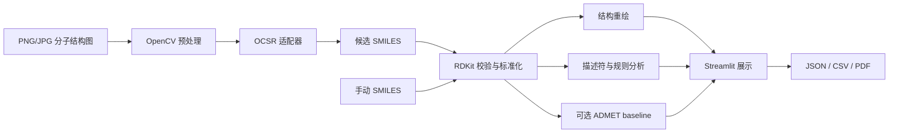

# 基于计算机视觉的分子结构图像识别与性质分析系统

本项目面向医药研发、化学文献数字化和实验室数据归档场景，基于 Python、OpenCV、OCSR 与 RDKit，实现二维分子结构图片到 SMILES 的自动识别、结构校验、分子重绘和基础性质分析，形成一个可演示、可批量处理、可导出报告的计算机视觉应用原型。

## 项目简介与企业需求

论文、专利、实验记录和药物资料中的分子结构常以图片存在，无法直接用于数据库检索或计算模型。系统提供以下数据入口：

- 将 PNG/JPG/JPEG 分子结构图转换为 SMILES；
- 使用 RDKit 校验和标准化结果，减少人工录入错误；
- 自动重绘结构，计算分子式、MW、LogP、TPSA、HBD、HBA 等；
- 批量处理文献或实验记录中的结构图，导出 CSV/JSON；
- 通过统一适配器接入 MolScribe、DECIMER 或其他 OCSR 模型；
- 在没有真实模型时使用稳定的 demo 流程完成教学演示。

项目重点是 OCSR 工程闭环，不是普通图像分类，也不以从零训练大型模型为目标。

## 功能列表

- 单图识别：格式检查、可视化预处理、OCSR、校验、重绘和报告；
- OpenCV 流程：灰度化、去噪、Otsu 二值化、白边裁剪、旋转校正、等比例归一化；
- 手动 SMILES：作为识别失败后的可靠补充入口；
- 描述符：分子式、MW、LogP、TPSA、HBD、HBA、可旋转键和重原子数；
- 规则判断：Lipinski 五规则指标及扩展可旋转键规则；
- 批量处理：逐图容错、结果表格、成功率/有效率和失败原因汇总；
- 导出：单图 JSON、批量 CSV/JSON、统计图和可选 PDF；
- 可选 ADMET baseline：用户提供带标签 CSV 后，可训练 Morgan Fingerprint + Random Forest 单终点模型；
- 工程稳定性：后端可用性诊断、模型实例缓存、分析 ID 隔离输出和端到端测试；
- Web 演示：Streamlit 四个页签，一条命令启动；
- 自动化测试：SMILES、描述符、规则、预处理和 demo 识别。

## 技术路线图



## 环境要求

- Python 3.10 或 3.11；
- CPU 即可运行 demo、OpenCV 和 RDKit 主流程；
- GPU 仅作为真实 OCSR 后端的可选加速设备。

### Conda 安装（推荐）

完整环境可直接创建：

```bash
conda env create -f environment.yml
conda activate molecule-vision
```

也可以手动安装：

```bash
conda create -n molecule-vision python=3.10
conda activate molecule-vision
conda install -c conda-forge rdkit
pip install -r requirements.txt
```

> RDKit 优先推荐通过 conda-forge 安装。如果已由 conda 安装，`pip install -r requirements.txt` 会检测已有版本；遇到平台相关问题时可从 requirements 中临时注释 `rdkit` 一行。

### pip 安装

在支持 RDKit wheel 的 Python 3.10/3.11 平台上：

```bash
python -m venv .venv
# Windows: .venv\Scripts\activate
# macOS/Linux: source .venv/bin/activate
python -m pip install --upgrade pip
pip install -r requirements.txt
```

## 快速启动

先生成清晰的演示结构图：

```bash
python scripts/make_demo_samples.py
```

启动 Web：

```bash
python -m streamlit run app.py
```

浏览器中可上传 `data/samples/aspirin.png`，查看原图、所有预处理阶段、识别 SMILES、RDKit 重绘和性质结果。

### PyCharm 运行注意事项

项目解释器应明确指向：

```text
C:\Users\17679\.conda\envs\molecule-vision-310\python.exe
```

推荐在 Run Configuration 中以模块方式启动，Module name 填 `streamlit`，Parameters 填 `run app.py`。在终端中也优先使用 `python -m streamlit run app.py`，避免调用到其他环境中的 `streamlit.exe`。

可用以下命令核对当前解释器和核心依赖：

```powershell
python -c "import sys; print(sys.executable)"
python -c "import cv2, rdkit, streamlit; print(cv2.__version__, rdkit.__version__, streamlit.__version__)"
```

若终端启动时把整段 PATH 当作 PowerShell 命令执行，应关闭从异常终端继承环境的 PyCharm 实例，并从 Windows 开始菜单重新启动 PyCharm；也可将 PyCharm Terminal 的 Shell path 临时设为 `powershell.exe -NoProfile`。

## 命令行使用

分析手动 SMILES：

```bash
python scripts/analyze_smiles.py --smiles "CCO"
```

批量处理：

```bash
python scripts/run_batch.py --input data/batch_input --output data/outputs
```

也可直接批量处理生成的样例：

```bash
python scripts/run_batch.py --input data/samples --output data/outputs --backend demo
```

## OCSR 后端说明

后端可在 Streamlit 侧边栏选择，也可设置环境变量：

```bash
# Windows PowerShell
$env:OCSR_BACKEND="demo"

# macOS/Linux
export OCSR_BACKEND=demo
```

### demo

默认模式不加载机器学习模型，而是根据文件名匹配四个内置样例：

| 文件名关键词 | SMILES |
|---|---|
| `aspirin` | `CC(=O)OC1=CC=CC=C1C(=O)O` |
| `caffeine` | `Cn1cnc2c1c(=O)n(C)c(=O)n2C` |
| `benzene` | `c1ccccc1` |
| `ethanol` | `CCO` |

界面会明确提示当前主动选择的是 demo 后端。RDKit 和 OpenCV 不是 OCSR 模型；只有额外安装并配置 MolScribe/DECIMER 后，才能切换到真实图像识别后端。

### MolScribe

MolScribe 是可选依赖，不会在项目启动时被强制导入。按照其对应版本文档安装后，设置模型文件与设备：

```bash
$env:MOLSCRIBE_MODEL_PATH="C:\path\to\checkpoint.pth"
$env:OCSR_DEVICE="auto"  # PyTorch CUDA 可用时使用 GPU；也可显式设为 cuda
python -m streamlit run app.py
```

不同 MolScribe 发行版本的模型构造与推理 API 可能变化；适配点集中在 `src/ocsr/molscribe_adapter.py`，不影响其他模块。

### DECIMER

DECIMER 同样是可选依赖。当前适配器支持暴露 `predict_SMILES` 的发行形式。若已安装版本的模块路径不同，只需调整 `src/ocsr/decimer_adapter.py` 中标注的适配位置。未安装或初始化失败时系统返回可读错误，不会崩溃。

适配器会优先请求后端返回置信度，并兼容不支持置信度参数的旧版本。Web 侧边栏会显示所选后端是否已成功加载。

## 可选 ADMET baseline

项目不会附带或伪造 ADMET 数据。准备一个至少包含 `smiles` 和目标标签列的可信 CSV 后，可训练单个分类或回归终点：

```bash
python scripts/train_admet.py \
  --input data/admet.csv \
  --smiles-column smiles \
  --target-column ames \
  --task classification \
  --output models/admet_baseline.joblib
```

训练完成后启用模型：

```bash
# Windows PowerShell
$env:ENABLE_ADMET_MODEL="true"
$env:ADMET_MODEL_PATH="models/admet_baseline.joblib"
python -m streamlit run app.py
```

模型文件使用 joblib 序列化，只应加载自己训练或可信来源的本地文件。未启用、文件缺失或预测失败时，系统会继续完成 RDKit 描述符与 Lipinski 规则分析。ADMET 输出仅是教学 baseline，不替代实验或专业结论。

## 测试

```bash
pytest -q
```

测试覆盖合法/非法 SMILES、canonical SMILES、描述符字段、规则超限、图像预处理、OCSR 兼容层、单图/手动 SMILES 端到端流程、批处理导出、PDF 报告以及可选 ADMET baseline。

## 项目目录

```text
molecule-vision-ocsr/
├── README.md
├── requirements.txt
├── environment.yml
├── config.py
├── app.py
├── data/
│   ├── samples/
│   ├── batch_input/
│   └── outputs/
├── models/                # 可选本地模型；模型文件不提交到 Git
├── src/
│   ├── preprocess/        # 图片读取、OpenCV 处理、过程可视化
│   ├── ocsr/              # 统一接口与 demo/MolScribe/DECIMER 适配器
│   ├── chem/              # RDKit 校验、描述符、规则、绘图
│   ├── analysis/          # 单分子报告与批处理编排
│   ├── export/            # JSON、CSV、可选 PDF
│   ├── ml/                # 可选 Morgan + Random Forest ADMET baseline
│   └── utils/             # 文件与日志工具
├── scripts/               # 批处理、SMILES 分析、样例生成、ADMET 训练
├── tests/                 # pytest 测试
└── docs/                  # 说明书、API 与报告模板
```

所有运行路径由 `config.py` 统一管理。默认输出写入 `data/outputs`，包括预处理图、重绘结构、批量表格和统计图。

## 答辩演示建议

1. 说明医药研发和专利中结构图片难以直接检索的企业需求；
2. 展示“图片 → OpenCV → OCSR → SMILES → RDKit → 报告”的路线；
3. 上传 `aspirin.png`，逐步展示 CV 中间结果；
4. 展示 canonical SMILES、结构重绘、描述符和 Lipinski 判断；
5. 输入 `CCO` 展示手动分析的稳定备用流程；
6. 批量处理 `data/samples` 并下载 CSV；
7. 说明 demo 与真实 OCSR 的边界和后续升级方向。

## 局限性与免责声明

- 当前系统主要支持清晰的二维分子结构图片；
- 复杂图片、手绘结构、低分辨率图片可能识别失败；
- demo 模式不是真实分子识别，只用于系统演示；
- 真实 OCSR 需要安装 MolScribe 或 DECIMER；
- MolScribe/DECIMER 的安装方式、模型权重和推理 API 可能随版本变化；
- Lipinski 结果只反映简单规则，不代表吸收、毒性、疗效或可开发性；
- 性质分析为教学演示，不能替代真实药物实验或专业判断。

## 生产 MolScribe 后端配置

本项目默认仍使用 `demo` 后端，demo 只用于教学演示：它会按内置样例文件名返回固定 SMILES，不是真实图片识别。真实 OCSR 需要单独安装 MolScribe、下载模型权重，并把 `OCSR_BACKEND` 切换为 `molscribe`。如果 MolScribe 未安装、模型文件缺失或加载失败，Streamlit、手动 SMILES、RDKit 性质分析、demo 后端和 DECIMER 后端仍会继续工作，并显示可读错误。

本适配器按 MolScribe 官方仓库公开接口进行兼容：构造模型时优先使用 `MolScribe(model_path, device=...)`，推理时优先使用 `predict_image_file(path, return_confidence=True)`；不同发行版本若返回 `dict`、字符串、元组或列表，适配器会归一化为统一结果字段。已对公开仓库接口形状做验证，未声称支持未测试的私有改版 API。

### 安装步骤

```bash
conda create -n molecule-vision-310 python=3.10
conda activate molecule-vision-310
conda install -c conda-forge rdkit
python -m pip install --upgrade pip
pip install -r requirements.txt
```

按 MolScribe 官方说明安装可选依赖。安装方式可能随 MolScribe 版本变化，请以其官方仓库为准：[thomas0809/MolScribe](https://github.com/thomas0809/MolScribe)。

```bash
pip install MolScribe
```

模型权重请从可信来源下载到本机，例如：

```text
models/molscribe_model.pth
```

不要把模型权重、大型数据集、虚拟环境或缓存文件提交到 Git。本仓库 `.gitignore` 已忽略 `models/*`、`*.pt`、`*.pth` 和 `*.onnx`。

### 环境变量

Windows PowerShell：

```powershell
$env:OCSR_BACKEND="molscribe"
$env:MOLSCRIBE_MODEL_PATH="C:\path\to\molscribe_model.pth"
$env:OCSR_DEVICE="cpu"
$env:MOLSCRIBE_IMAGE_STRATEGY="original"
python -m streamlit run app.py
```

Linux/macOS：

```bash
export OCSR_BACKEND=molscribe
export MOLSCRIBE_MODEL_PATH=/path/to/molscribe_model.pth
export OCSR_DEVICE=cpu
export MOLSCRIBE_IMAGE_STRATEGY=original
python -m streamlit run app.py
```

CUDA 示例：

```powershell
$env:OCSR_BACKEND="molscribe"
$env:MOLSCRIBE_MODEL_PATH="C:\path\to\molscribe_model.pth"
$env:OCSR_DEVICE="cuda"
python -m streamlit run app.py
```

常用配置：

| 变量 | 默认值 | 说明 |
|---|---|---|
| `MOLSCRIBE_MODEL_PATH` | `models/molscribe_model.pth` | MolScribe 权重文件路径，支持相对路径和绝对路径 |
| `MOLSCRIBE_MODEL_NAME` | 权重文件名 | 侧边栏和结果中显示的模型名 |
| `MOLSCRIBE_MODEL_VERSION` | 空 | 可选模型版本或标识 |
| `OCSR_DEVICE` | `auto` | `auto`、`cpu`、`cuda` 或 `cuda:0`；`auto` 会在 PyTorch CUDA 可用时使用 GPU |
| `OCSR_TIMEOUT_SECONDS` | `120` | 单次推理超时时间 |
| `OCSR_STRICT_MODE` | `false` | 为 `true` 时 CUDA 不可用会直接报错；默认可回退 CPU |
| `OCSR_USE_PREPROCESSED_IMAGE` | `false` | 兼容旧流程；默认 MolScribe 使用原图 |
| `MOLSCRIBE_IMAGE_STRATEGY` | `original` | `original`、`grayscale`、`normalized`、`binary` |

默认 `original` 更贴近 MolScribe 官方模型输入预期；不要默认假设二值化图片一定更好。只有在实验需要时再切换 `grayscale`、`normalized` 或 `binary`。

### 诊断命令

```bash
python scripts/check_ocsr_backend.py --backend demo
python scripts/check_ocsr_backend.py --backend molscribe
```

诊断输出包含 Python 版本、后端名称、包是否安装、包版本、模型路径、模型文件是否存在、设备、CUDA 是否可用、模型是否成功加载和可读错误。MolScribe 未安装时不会打印 Python 堆栈并崩溃。

### 常见错误

- `未安装 MolScribe`：先确认当前 Python 环境是否正确，再按官方说明安装 MolScribe。
- `模型文件不存在`：检查 `MOLSCRIBE_MODEL_PATH`，Windows 路径建议使用 PowerShell 字符串。
- `请求 CUDA 设备，但 torch.cuda.is_available() 为 False`：检查 NVIDIA 驱动、CUDA 版 PyTorch 和 `OCSR_DEVICE`；也可先用 `OCSR_DEVICE=cpu` 验证流程。
- `模型加载失败`：通常是权重文件与 MolScribe 代码版本不匹配，或模型文件损坏。请重新下载与当前 MolScribe 版本匹配的权重。
- `MolScribe 未返回 SMILES`：图片可能不符合模型输入分布，或该版本返回格式发生变化。可运行诊断脚本并保留错误信息用于适配。

## 生产 DECIMER 后端配置

DECIMER 也是可选真实 OCSR 后端。未安装 DECIMER 或 TensorFlow 环境不可用时，demo、MolScribe、手动 SMILES、RDKit、批处理和评测框架仍应继续运行。系统不会在 DECIMER 不可用时自动伪装成 demo 识别成功。

本适配器按 DECIMER Image Transformer 官方公开用法适配：[Kohulan/DECIMER-Image_Transformer](https://github.com/Kohulan/DECIMER-Image_Transformer)。官方安装方式为：

```bash
pip install decimer
```

本仓库提供了可选依赖清单，用于复现当前已验证环境：

```bash
python -m pip install -r requirements-decimer.txt
```

已在 Windows / Python 3.10 环境验证的版本：

```text
decimer==2.8.0
tensorflow==2.20.0
wrapt==2.2.2
tqdm==4.68.4
```

本机诊断还补齐了 TensorFlow/DECIMER 导入链需要的 `flatbuffers`、`libclang`、`termcolor`、`selfies`、`namex`、`tifffile`、`tensorboard-data-server` 和 `sympy`。这些依赖写在 `requirements-decimer.txt` 中，避免只在开发机上“临时可用”。DECIMER 首次初始化可能会把模型缓存下载到用户目录，例如 Windows 下的 `C:\Users\<用户名>\.data\DECIMER-V2`；该缓存不属于仓库内容，也不要提交到 Git。

公开推理接口为：

```python
from DECIMER import predict_SMILES
predict_SMILES(image_input, confidence=False, hand_drawn=False)
```

其中 `image_input` 可以是图片路径或 numpy 图像数组。不同版本可能返回字符串、元组、列表或字典；适配器会统一归一化为 `OCSRResult`。如果 DECIMER 只返回 token 级置信度或不返回可信整体置信度，系统会把 `confidence` 置为 `null`，不会伪造数值。

### CPU 启动

Windows PowerShell：

```powershell
$env:OCSR_BACKEND="decimer"
$env:DECIMER_DEVICE="cpu"
$env:DECIMER_IMAGE_STRATEGY="original"
python -m streamlit run app.py
```

Linux/macOS：

```bash
export OCSR_BACKEND=decimer
export DECIMER_DEVICE=cpu
export DECIMER_IMAGE_STRATEGY=original
python -m streamlit run app.py
```

### GPU/auto 启动

```powershell
$env:OCSR_BACKEND="decimer"
$env:DECIMER_DEVICE="auto"   # auto 会在 TensorFlow 检测到 GPU 时使用 GPU，否则回退 CPU
python -m streamlit run app.py
```

严格 GPU 模式：

```powershell
$env:OCSR_BACKEND="decimer"
$env:DECIMER_DEVICE="gpu"
$env:DECIMER_STRICT_MODE="true"
python -m streamlit run app.py
```

如果 strict 模式下 TensorFlow 未检测到 GPU，DECIMER 会返回清晰错误；非 strict 模式会安全回退 CPU，并在状态中显示实际设备。

### DECIMER 配置项

| 变量 | 默认值 | 说明 |
|---|---|---|
| `DECIMER_DEVICE` | `auto` | `cpu`、`gpu` 或 `auto` |
| `DECIMER_TIMEOUT_SECONDS` | `120` | 单次初始化/推理超时时间 |
| `DECIMER_IMAGE_STRATEGY` | `original` | `original`、`grayscale`、`normalized`、`binary` |
| `DECIMER_MODEL_NAME` | `DECIMER Image Transformer` | 报告和界面显示用模型名 |
| `DECIMER_MODEL_VERSION` | 空 | 可选模型/包版本备注 |
| `DECIMER_STRICT_MODE` | `false` | 为 `true` 时 GPU 不可用会报错，不回退 CPU |

当前官方 `decimer` 包通常自行管理模型资源；本项目不新增伪造的 DECIMER checkpoint 路径配置。如你使用的发行版本需要外部模型目录，应先按该版本官方说明安装配置，再用诊断脚本确认。

### DECIMER 诊断

```bash
python scripts/check_ocsr_backend.py --backend decimer
```

诊断输出包括 Python 版本、DECIMER 是否安装、包版本、TensorFlow 版本、GPU 状态、检测到的 GPU、设备选择、输入策略、初始化是否成功、最近推理耗时和可读错误信息。未安装或版本不兼容时不会直接打印未处理堆栈。

### DECIMER 常见错误

- `未安装 DECIMER`：确认当前 Python 环境后执行 `python -m pip install -r requirements-decimer.txt`。
- `No module named 'wrapt'`：TensorFlow 导入依赖缺失，安装 `requirements-decimer.txt` 或执行 `python -m pip install wrapt`。
- `No module named 'tqdm'`：DECIMER 依赖链缺失，安装 `requirements-decimer.txt` 或执行 `python -m pip install tqdm`。
- `TensorFlow 未检测到可用 GPU`：检查 NVIDIA 驱动、CUDA/cuDNN 与 TensorFlow 版本；也可先用 `DECIMER_DEVICE=cpu` 验证流程。
- `DECIMER 初始化失败`：可能是 TensorFlow、模型资源下载/缓存或版本兼容问题。请先运行诊断命令并记录包版本。
- `DECIMER 未返回 SMILES`：图片可能不符合模型输入分布，或该版本返回格式发生变化。

本机已验证 DECIMER 2.8.0 可以完成后端初始化诊断，并自动回退到 CPU。当前 Windows 环境未检测到 TensorFlow GPU，真实 GPU 推理仍需要你按目标平台配置匹配的 NVIDIA 驱动、CUDA/cuDNN 与 TensorFlow 运行时。默认单元测试仍使用 mock/fake 后端，不要求下载 DECIMER 模型。

## MolScribe + DECIMER ensemble 融合模式

`ensemble` 是统一的多后端 OCSR 模式，会保留 MolScribe 与 DECIMER 的全部原始候选，再用 RDKit 做标准化、有效性校验和候选差异解释。它可以用于 Streamlit、批处理 CLI 和 benchmark：

```powershell
$env:OCSR_BACKEND="ensemble"
$env:OCSR_ENSEMBLE_BACKENDS="molscribe,decimer"
$env:OCSR_ENSEMBLE_PARALLEL="false"
$env:OCSR_DEVICE="cuda"
$env:DECIMER_DEVICE="auto"
python -m streamlit run app.py
```

```bash
python scripts/run_batch.py --input data/batch_input --output data/outputs/batch --backend ensemble
python scripts/evaluate_ocsr.py --manifest benchmark/example_manifest.csv --backend ensemble --output data/outputs/benchmark
python scripts/check_ocsr_backend.py --backend ensemble
```

默认 `OCSR_ENSEMBLE_PARALLEL=false`，采用串行安全模式，避免在同一张 4080S 上同时加载多个大型模型导致显存压力。确认显存、CUDA/PyTorch/TensorFlow 配置稳定后，可以显式启用并行：

```powershell
$env:OCSR_ENSEMBLE_PARALLEL="true"
$env:OCSR_ENSEMBLE_TOTAL_TIMEOUT_SECONDS="240"
```

### 融合规则

- 后端执行成功优先于失败；
- RDKit 可解析候选优先于不可解析候选；
- canonical SMILES 或 InChIKey 相同的候选视为模型一致；
- 两个有效候选不一致时标记 `disagreement`，页面和报告会显示分歧警告；
- 不一致时只按 `OCSR_ENSEMBLE_BACKEND_PRIORITY` 和可选可靠性权重暂选推荐结果，不会声称已确认图片真实答案；
- 不直接比较 MolScribe 与 DECIMER 未校准的原始 confidence；
- 人工修正会覆盖 ensemble 推荐，并保留所有原始候选用于追溯。

可选配置：

| 变量 | 默认值 | 说明 |
|---|---|---|
| `OCSR_ENSEMBLE_BACKENDS` | `molscribe,decimer` | 启用的子后端 |
| `OCSR_ENSEMBLE_BACKEND_PRIORITY` | `molscribe,decimer` | 分歧时的暂选优先级 |
| `OCSR_ENSEMBLE_RELIABILITY_WEIGHTS` | `molscribe=1.0,decimer=1.0` | 可由 benchmark 校准后填写的可靠性权重 |
| `OCSR_ENSEMBLE_PARALLEL` | `false` | 是否并行执行子后端 |
| `OCSR_ENSEMBLE_CONTINUE_ON_ERROR` | `true` | 单个后端失败时是否继续 |
| `OCSR_ENSEMBLE_TOTAL_TIMEOUT_SECONDS` | `240` | ensemble 总任务超时 |

### 分歧解释

当 MolScribe 与 DECIMER 给出不同有效分子时，系统会计算：

- canonical SMILES 是否相同；
- InChIKey 是否相同；
- Morgan fingerprint Tanimoto 相似度；
- 分子式是否相同；
- 原子数量差异；
- 总形式电荷差异。

这些指标只解释候选之间的结构差异，不能自动证明哪一个候选更符合原始图片。没有真实 benchmark 证明前，本项目不声称 ensemble 一定比单模型更准确。

### 本机 GPU 说明

本项目现在默认让 MolScribe 使用 `OCSR_DEVICE=auto`，当 PyTorch 能检测到 CUDA 时会使用本机 GPU；你也可以显式设置 `$env:OCSR_DEVICE="cuda"`。DECIMER 使用 TensorFlow，需 TensorFlow 能检测到 GPU 才会用 4080S；当前本机诊断显示 `tensorflow==2.20.0` 未检测到 GPU，因此 DECIMER 会安全回退 CPU。后续若要让 DECIMER 使用 4080S，建议先解决 TensorFlow GPU 运行时，再用：

```bash
python scripts/check_ocsr_backend.py --backend decimer
```

确认 `gpu_available: true` 后再跑真实 benchmark。

## 化学标准化与审计链

系统在 RDKit 可解析之后会生成独立的化学身份与标准化审计块，且不会覆盖模型原始输出或人工修正输入。JSON 报告中会同时保留：

- `ocsr.predicted_smiles`：模型原始 SMILES；
- `ocsr.predicted_canonical_smiles` 和 `ocsr.predicted_standardized_smiles`：模型输出的解析与标准化结果；
- `correction.corrected_smiles`：用户输入的人工修正；
- `final.raw_smiles`：最终来源的原始输入；
- `final.smiles` / `final.standardized_smiles`：用于性质计算和结构重绘的最终分析 SMILES；
- `chemical_identity`：canonical SMILES、standardized SMILES、InChI、InChIKey、分子式、形式电荷、片段数和手性中心数；
- `standardization.steps`：每一步的输入、输出、是否改变、warning、时间、RDKit 版本和 profile；
- `structure_warnings`：结构质量提示。

### 标准化 profile

通过环境变量选择：

```powershell
$env:CHEM_STANDARDIZATION_PROFILE="conservative"
python -m streamlit run app.py
```

可选值：

| profile | 行为 |
|---|---|
| `none` | 只解析、canonicalize 和生成身份标识，不执行 RDKit 标准化转换 |
| `conservative` | 默认值；执行 RDKit `Cleanup` / `Normalize`，不删除片段、不强制中和、不做互变异构归一 |
| `parent` | 执行金属断开、FragmentParent、LargestFragmentChooser 和 Uncharger，可能去除盐/溶剂/配位成分 |
| `tautomer_canonical` | 在 `parent` 基础上执行 Reionize 与 RDKit tautomer canonicalization |

默认采用 `conservative`，避免自动删除用户可能关心的盐、溶剂、多片段或配位结构。`parent` 和 `tautomer_canonical` 都可能改变化学含义，应只在明确需要 parent identity 或去重时启用。

### 结构质量提示

系统会提示：

- 多片段；
- 非零电荷；
- 未指定手性；
- 未指定 E/Z 双键；
- 异常价态或 RDKit sanitize 问题；
- 同位素；
- 金属或类金属。

这些提示只说明结构表示和身份检索风险，不是毒理、药理或实验结论。

### 批处理去重

批处理 CSV 会增加：

- `canonical_smiles`
- `standardized_smiles`
- `inchikey`
- `standardization_profile`
- `standardization_changed`
- `structure_warnings`

批处理 JSON summary 会增加 canonical SMILES、InChIKey 和 standardized SMILES 的重复统计，用于发现同一分子在不同图片或不同盐形式中的重复。

### Benchmark 身份比较

默认 benchmark 仍按 raw canonical SMILES 评价，避免历史指标语义改变：

```bash
python scripts/evaluate_ocsr.py --manifest benchmark/example_manifest.csv --backend demo --identity-comparison raw
```

如需按标准化身份比较：

```bash
python scripts/evaluate_ocsr.py \
  --manifest benchmark/example_manifest.csv \
  --backend ensemble \
  --identity-comparison standardized \
  --standardization-profile parent \
  --output data/outputs/benchmark
```

标准化比较可以用于盐型、parent identity 或去重分析，但不能被解释为模型一定识别得更准确；它只改变“比较哪一种化学身份表示”的规则。

### InChI 降级

如果当前 RDKit 构建不支持 InChI，报告会把 `inchi` / `inchikey` 置空，并在 `standardization.warnings` 中记录原因；主流程、性质计算、JSON/CSV/PDF 导出不会因此中断。
